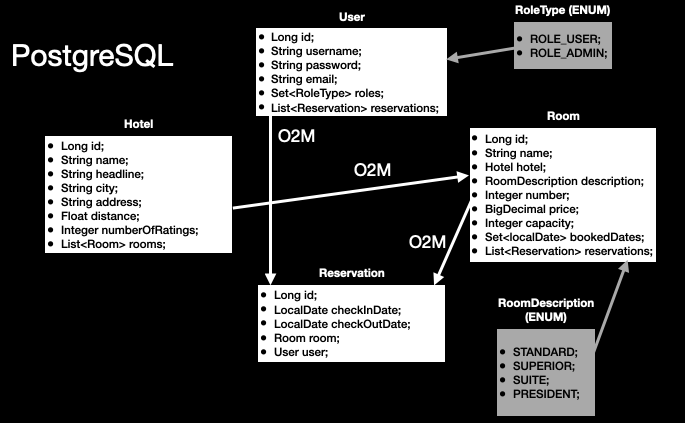
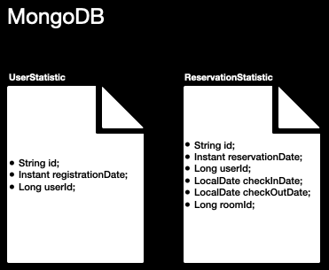

# SPRING COURSE FINAL PROJECT: BOOKING SYSTEM


___

Hello everyone :wave:
___

## Summary

This is an application for manage of Booking system: here you can create and storage all the information about hotels, 
rooms, users and reservation. Here was implemented a mvc pattern, was created a security system and features for analysis of statistics and efficiency you hotel corporation!

So lets look at the backend part of booking-system a little more details.

## How launch this application?

1) First of all you need to clone this repository to your local machine
2) Then you need to launch Docker application
3) And finally:
   1. Go into the docker directory (in root of this project)
   2. Then got to the console and write: `sh booking-service-launcher.sh` (for Linux / Mac) or `cmd booking-service-launcher.cmd` (for Windows)

___

## Data structure (dao)

You can find a schemas of the data structure in this application for storage the information in SQL and NoSQL databases:





___

## Data structure (dto)

### Hotel part:

```
CreateHotelRequest.java;
UpdateHotelRequest.java;
HotelResponse.java;
HotelResponseList.java;
```

### Room part:
```
UpsertRoomRequest.java;
SimpleRoomResponse.java;
RoomResponseList.java;
```

### User part:
```
CreateUserRequest.java;
UpdateUserRequest.java;
UserResponse.java;
UserResponseList.java;
```

### Reservation part:
```
ReservationResponse.java;
ReservationResponseList.java;
UpsertReservationRequest.java;
```

### Defaults:
```
ErrorResponse.java;
FindAllSettings.java;
HotelFilter.java;
RoomFilter.java;
```

### Statistic:
```
StatisticDto.java;
StatisticType.java;
```

___

## Controllers and security settings

Default prefix for each of the urls is `http://localhost:8080`

This application has the following controllers and endpoints:

1) Public controller:
   1. POST: `/api/public/account` -> All users without authorization
2) User controller:
   1. GET: `/api/user` -> ADMIN
   2. GET: `/api/user/{id}` -> All users with authorization (with USER role - only yourself data)
   3. GET: `/username/{username}` -> All users with authorization (with USER role - only yourself data)
   4. POST: `/api/user` -> ADMIN
   5. PUT: `/api/user/{id}` -> All users with authorization (with USER role - only yourself data)
   6. DELETE: `/api/user/{id}` -> All users with authorization (with USER role - only yourself data)
3) Hotel controller:
   1. GET: `/api/hotel` -> All users with authorization
   2. GET: `/api/hotel/filter` -> All users with authorization
   3. GET: `/api/hotel/{id}` -> All users with authorization
   4. POST: `/api/hotel` -> ADMIN
   5. PUT: `/api/hotel/{id}` -> ADMIN
   6. DELETE: `/api/hotel/{id}` -> ADMIN
   7. PUT: : `/api/hotel/rate/{id}` -> All users with authorization
4) Room controller:
   1. GET: `/api/room` -> All users with authorization
   2. GET: `/api/room/filter` -> All users with authorization
   3. GET: `/api/room/{id}` -> All users with authorization
   4. POST: `/api/room` -> ADMIN
   5. PUT: `/api/room/{id}` -> ADMIN
   6. DELETE: `/api/room/{ID}` -> ADMIN
5) Reservation controller:
   1. GET: `/api/reservation` -> ADMIN
   2. GET: `/api/reservation/{id}` -> All users with authorization (with USER role - only yourself data)
   3. POST: `/api/reservation` -> All users with authorization
   4. PUT: `/api/reservation/{id}` -> All users with authorization (with USER role - only yourself data)
   5. DELETE: `/api/reservation/{id}` -> All users with authorization (with USER role - only yourself data)
6) Statistic controller:
   1. GET: `/api/statistic` -> ADMIN

### _You can find the full controller documentation on [OpenAPI web client](http://localhost:8080/swagger-ui/index.html) after launching this application and logging with ADMIN access_

___

## Services

### User service
1) Provides you access to CRUD operation
2) Additionally, gives a method of validation the user`s input (by username and email of new user) to avoid any double the data in database
3) For update/delete -> service go into the Validation service for validate this action (is it an Admin or Owner)

### Hotel service
1) Provides you access to CRUD operation
2) Method for rating update
3) Method for update room list
4) Additionally, gives a method for findAll with pagination and filter by Hotel settings

### Room service
1) Provides you access to CRUD operation
2) Method for update (add or delete) reservation
3) Additionally, gives a method for findAll with pagination and filter by Room settings
4) And methods for validate the dats: check if this date is available/unavailable, create a Full dates list based on check in / out dates

### Reservation service
1) Provides you access to CRUD operation
2) Save and Delete features are changed by reservation specific: save = booking, delete = cancel
3) For update/delete -> service go into the Validation service for validate this action (is it an Admin or Owner)

### Validation service
1) Only one method for checking the user`s action: is it an admin or entity owner? If both of this question is false, service throw Access Denied exception

___

## Caching of data for the best user experience
Application has a features for caching the rooms requests in the memory (default expiry time is 2m):
```java
public interface CacheNames {
        String ALL_ROOMS = "allRooms";
        String ALL_ROOMS_WITH_FILTER = "allRoomsWithFilter";
        String ROOM_BY_ID = "roomById";
    }
```
Based on the names, cache are used for:
1) ALL_ROOMS -> for `findAll()` rooms without filter
2) ALL_ROOMS_WITH_FILTER -> for `findAll(FindAllSettings settings)` rooms with filter
3) ROOM_BY_ID -> for `findById(Long id)` room

Cache evict are using when room entity are updated, saved new ono and deleted
___

## Security settings

### Spring security

The main Security Filter Chain settings are bellow:
```
               (auth) -> auth.requestMatchers("/api/public/**").permitAll()
                        .requestMatchers("/swagger-ui/**").hasAnyRole("ADMIN")
                        .anyRequest().authenticated()
```
Here you can see the following rules:
1) All users can create a new account by url `.../api/public/...`
2) Only admin can check the swagger (OpenAPI) controllers specifications
3) All requests are checking for credentials by another urls

### Addition validation of user`s actions

Additional validation are implemented with help of transfer `@AuthenticationPrincipal UserDetails userDetails` from controllers 
to the services for checking by ValidationService.

___

## Kafka listener and features (statistic layer)
Kafka listening are implemented for statistic layer: userService create a new Event and send it to the `app.kafka.userTopic`
when somebody create a new User (in the PublicController/UserController endpoints); 
reservationService create a new Event and send it to the `app.kafka.reservationTopic` when somebody create a new Reservation in the application.

Then Kafka listener catches it and save a new documents in the MongoDB collections.

User with role ADMIN can download it with help of `StatisticControllers endpoint`.

